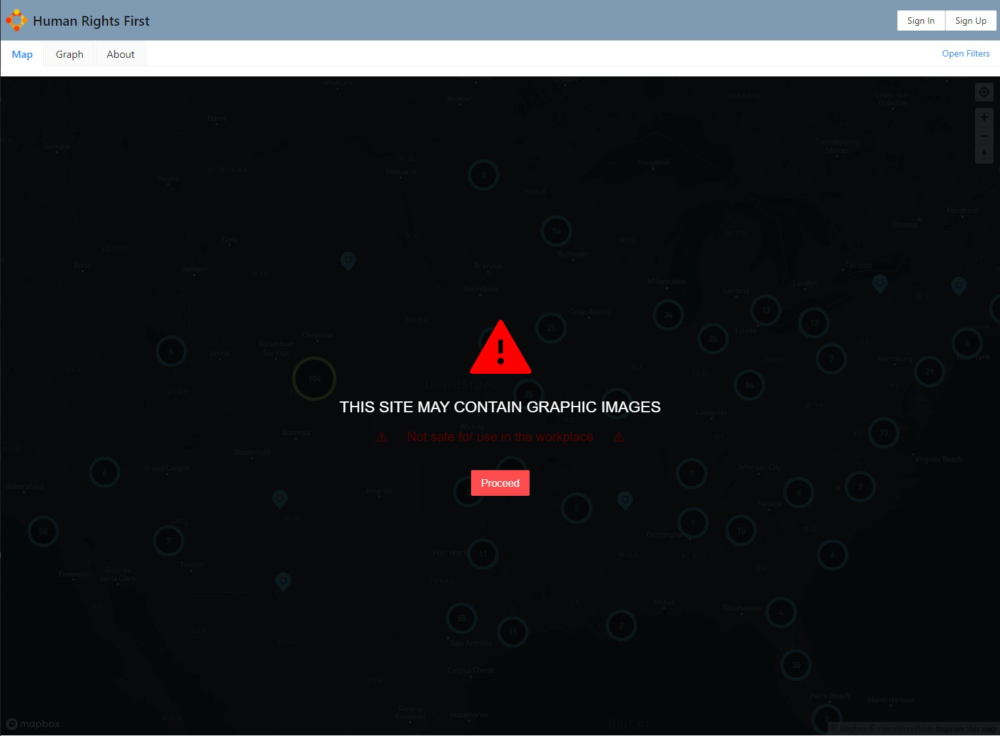

# Human Rights First Police Use of Force Map - Front End

## Description 👇
> **Disclaimer:** This application is currently in Alpha (as of Oct 20, 2020) and is not ready for production. Please use at your own risk as things will change almost daily.

- Our team is developing an interactive map that identifies potential instances of police use of force across the United States of America for [Human Rights First](https://www.humanrightsfirst.org/), an independent advocacy and action organization. We are also developing additional graphics to track and display police brutality trends.
- An application that takes information from data provided by the data science team collecting relevant incidents and data from Twitter, Reddit, and police agencies to display it on the map.
- This app will display various incidents of police use of force on a map that can be filtered by  type of brutality and location with zipcodes and states.

## Deployed App
- https://d.humanrightsfirst.dev/

## Features

- a dynamic navigation bar with tabs displaying either the Map, the Graph, or the About page as well as a popup with the Filter form
- Sign in/Sign out options `(not functional)`
- Graph: 
    - timelime view of number of incidents over the course of a year (data dates range) 
    - ability to filter out data by type of brutality used
- Filter `(currently applying just for the map)`: 
    - date range implemented `(not functional)`
    - reset filters `(not functional)`
    - select state dropdown or search state by typing(selected state can be removed with one click on the x  button on the right afterwards): zooms onto the selected state
    - search by zip-code (looked up zipcode can be removed with the x  button on the right of it afterwards): zooms onto a zipcode location
    - filter incidents by type of brutality
    - filter incidents by type of source like Twitter, Reddit, etc `(not functional)`
- Map:
    - graphic content warning screen 
    - Control panel:
        - ability to navigate and zoom on to user's location
        - zoom in/out the map 
        - reset bearing to north
    - dynamic Hide/Show Map Options menu:
        - enable/disable zooming on the map with mouse scroll wheel 
        - enable/disable fast travel states: turns on a hover option for each screen and zooms onto the highlighted state when clicked 
        - reset map view to the original view

## Requirements

- [Labs Engineering Standard requirements found here](https://www.notion.so/Human-Rights-First-Roadmap-Team-Kevin-c53ed8e80b0e4584aba47abee5753591)

### Environment variable

- `REACT_APP_MAPBOX_TOKEN` Mapbox access tokens (check `https://docs.mapbox.com/help/how-mapbox-works/access-tokens/`)
> the token can be found on the previous team's deployment info page or recreated on mapbox studio

## Components

- Loading Page
- NavBar
- Filter Form
- Map
- Graph
- About

## Styling Our App
- `CSS`
- `AntD`

## Data Visualization 
`MapBox` - https://docs.mapbox.com :
- using mapboxgl approach

## The Team
- [Hira Khan](https://github.com/Hira63S)    - Team Project Lead

- [Cedric Winbush](https://github.com/caw442000)    - Team Project Lead

- [Virginia Davenport](https://github.com/virginia-d90)      - Back End Engineer

- [Juan Rivera](https://github.com/Juan-Rivera)    - Back End Engineer

- [Barbara Moore](https://github.com/barbaralois)    - Front End Engineer

- [Blayze Stone](https://github.com/blayzestone)    - Front End Engineer

- [Marta Krawczyk](https://github.com/MartaKode)    - Front End Engineer

- [David Cruz](https://github.com/DAVIDCRUZ0202)    - Data Science Engineer

- [Johann Augustine](https://github.com/DataLovecraft)    - Data Science Engineer

## ⚠ Contributing - future features needed/desired for this project:

> Please refer to the highlited parentheses statements throughout this ReadMe for better understanding

- successful connection between Back End and Data Science teams
- successful connection between Back End and Front End teams
- Register/Login functionality added (currenly not functional)
- ability to reset filters
- ability to apply and filter by date range
- ability to filter by source type
- prevent map refresh/reload when filtering data by incident type:
    - instead of state or global variables for the filter function, more research can be done on filtering layers inside of map.addLayer() functions using filter functions mapbox has
    - setting filters is also an options:  https://docs.mapbox.com/mapbox-gl-js/api/map/#map#setfilter
- make filter for functional with the Graph
    - add more options to the Graph like filtering by state or zipcode or displaying data based off of date range
